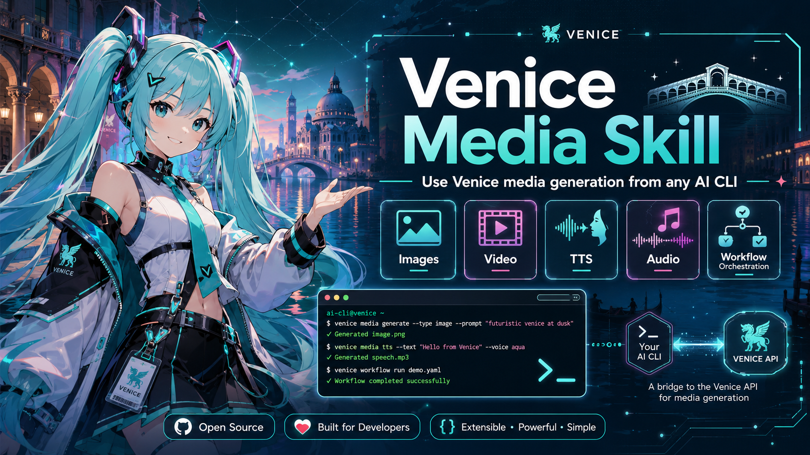

# Venice Media Skill

[](https://www.python.org/downloads/)
[](https://opensource.org/licenses/MIT)
[](https://github.com/astral-sh/ruff)
[](https://mypy-lang.org/)
[](https://docs.pytest.org/)

---

<div align="center">



</div>

---

**Venice Media Skill** is a public-ready, host-neutral Agent Skill and Python bridge that lets an existing AI CLI use the Venice API for media generation **without replacing the original host agent**.

The host agent&mdash;Kimi Code, Codex, Claude Code, Gemini CLI, OpenCode, or another shell-capable interface&mdash;continues to reason, ask questions, and manage the conversation. This package provides a narrow subprocess boundary for:

- 🎨 **Image generation, editing, multi-edit, and upscaling**
- 🪟 **Background removal**
- 🎬 **Video generation, retrieval, editing, extension, and stitching** through supported Venice models
- 🔊 **Text-to-speech (TTS)**
- 🎵 **Music and generated audio**
- 🎙️ **Audio transcription**
- 🔍 **Live model discovery and model-aware parameter planning**
- ✅ **Quotes, queue persistence, polling, artifact storage, and metadata sidecars**

---

## ✨ Features

| Feature | Description |
|---------|-------------|
| **Host-Neutral** | Works with any shell-capable AI agent |
| **Live Model Discovery** | Queries `GET /models` dynamically, no hard-coded catalog |
| **Agent-Readable I/O** | Commands emit structured JSON to stdout, errors to stderr |
| **Safe Credential Boundary** | `VENICE_API_KEY` read only from environment, never written to manifests |
| **Recover Queued Jobs** | Video and audio queue IDs stored locally for retrieval |
| **Prevent Duplicate Spend** | Timeouts return resumable queue IDs, no auto-resubmission |
| **Quote Before Queued Generation** | Video/audio can return quotes requiring explicit approval |
| **Model-Aware Clarification** | Host asks only relevant questions based on selected model constraints |
| **Auditable Outputs** | Every artifact receives JSON metadata sidecar with model, prompt, parameters |

---

## 📋 Table of Contents

- [🚀 Quick Start](#-quick-start)
- [📦 Installation](#-installation)
- [🔑 Configuration](#-configuration)
- [🎯 Usage](#-usage)
- [📚 Documentation](#-documentation)
- [🏗️ Architecture](#-architecture)
- [🔒 Security](#-security)
- [🤝 Contributing](#-contributing)
- [📜 License](#-license)
- [📞 Support](#-support)

---

## 🚀 Quick Start

### Prerequisites

- **Python** 3.11 or newer
- **Venice API Key** - [Get yours from Venice](https://api.venice.ai)
- **Host Agent** - Kimi Code, Codex, Claude Code, Gemini CLI, OpenCode, or any shell-capable interface
- **Operating System** - macOS, Linux, WSL, or Windows PowerShell

### 1. Install the Package

```bash
# Clone the repository
git clone https://github.com/spearchucker667/venice-media-skill.git
cd venice-media-skill

# Install in editable mode
python -m pip install -e .
```

### 2. Configure API Key

Set the environment variable in your shell:

**macOS / Linux / WSL:**
```bash
export VENICE_API_KEY='your-venice-api-key-here'
```

**Windows PowerShell:**
```powershell
$env:VENICE_API_KEY = 'your-venice-api-key-here'
```

> ⚠️ **Security Note:** Store credentials securely using your OS keychain or credential manager. Never commit API keys to version control.

### 3. Verify Installation

```bash
venice-media --version
venice-media doctor --online
```

---

## 📦 Installation

### Development Installation

```bash
# Create virtual environment
python -m venv .venv

# Activate it (macOS/Linux: source .venv/bin/activate, Windows: .\.venv\Scripts\activate)
source .venv/bin/activate

# Install with dev dependencies
python -m pip install --upgrade pip
python -m pip install -e '.[dev]'

# Install the skill for your agent
venice-media install-skill --host kimi --scope user
```

### Script-Based Installation

**macOS / Linux / WSL:**
```bash
./scripts/install.sh --host kimi --scope user
```

**Windows PowerShell:**
```powershell
.\scripts\install.ps1 -HostName kimi -Scope user
```

This creates an isolated virtual environment at `~/.local/share/venice-media-skill/venv` and installs a launcher at `~/.local/bin/venice-media`.

> Ensure `~/.local/bin` is on your `PATH`.

---

## 🔑 Configuration

### Environment Variables

| Variable | Required | Description | Default |
|----------|----------|-------------|---------|
| `VENICE_API_KEY` | ✅ Yes | Your Venice API key | None |
| `VENICE_MEDIA_OUTPUT_DIR` | ❌ No | Custom output directory | `./venice-media-output` |
| `VENICE_API_BASE` | ❌ No | Custom API base URL | `https://api.venice.ai/api/v1` |

### Configuration Directories

- **Cache:** `~/.cache/venice-media-skill` (models cache, 1-hour TTL)
- **Config:** `~/.config/venice-media-skill` (configuration files)
- **State:** `~/.local/state/venice-media-skill` (queue records)
- **Output:** `./venice-media-output` (generated artifacts and metadata)

---

## 🎯 Usage

### CLI Commands

#### Health Check

```bash
# Check local configuration
venice-media doctor

# Check connectivity to Venice API
venice-media doctor --online
```

#### Discover Models

```bash
# List all models
venice-media models

# List image generation models
venice-media models --type image

# List TTS models
venice-media models --type tts

# List video models
venice-media models --type video

# Refresh model cache
venice-media models --type image --refresh
```

#### Model-Aware Planning

```bash
# Get questions for image generation
venice-media plan image.generate

# Get model-specific questions
venice-media plan image.generate --model venice-sd35

# Get questions for video generation
venice-media plan video.generate --model MODEL_ID
```

#### Execute Requests

```bash
# Dry run (no API call, shows payload)
venice-media run examples/requests/image-generate.json

# Execute with actual API call
venice-media run my-request.json
```

#### Schema

```bash
# View request manifest JSON Schema
venice-media schema

# Save to file
venice-media schema --output my-schema.json
```

#### Queue Management

```bash
# List queued jobs
venice-media jobs list

# Get job details
venice-media jobs get QUEUE_ID
```

#### Validation

```bash
# Validate OpenAPI snapshot
venice-media validate-openapi

# Full validation suite
./scripts/validate.sh
```

---

## 📚 Documentation

### Core Guides

- [🏗️ **Architecture**](docs/architecture.md) - System design and trust zones
- [🤖 **Agent Workflow**](docs/agent-workflow.md) - How agents interact with the bridge
- [🎬 **Media Generation Guide**](docs/media-generation-guide.md) - Complete media workflow documentation
- [🔌 **Host Integrations**](docs/host-integrations.md) - Kimi Code, Codex, and other agent setup
- [🔒 **Security & Privacy**](docs/security-and-privacy.md) - Security invariants and best practices
- [🐛 **Troubleshooting**](docs/troubleshooting.md) - Common issues and solutions
- [🚀 **Releasing**](docs/releasing.md) - Release process and automation

### Reference Materials

- [📄 **Request Schema**](references/request.schema.json) - JSON Schema for request manifests
- [📖 **Venice API Index**](references/venice-api-llms.md) - Venice API documentation snapshot
- [🎥 **Seedance 2.0 API Guide**](references/seedance-2-0-api-guide.md) - Video generation workflows
- [✅ **Seedance Face Consent Guide**](references/seedance-face-consent-api-guide.md) - Face media consent requirements
- [📡 **Venice OpenAPI**](references/venice-openapi.yaml) - Complete API specification snapshot

### Root Documentation

- [📜 **CHANGELOG**](CHANGELOG.md) - Version history and changes
- [🤝 **CODE OF CONDUCT**](CODE_OF_CONDUCT.md) - Contribution standards
- [📝 **CONTRIBUTING**](CONTRIBUTING.md) - Development and PR guidelines
- [🛡️ **SECURITY**](SECURITY.md) - Security policy and reporting
- [📄 **LICENSE**](LICENSE) - MIT License
- [📋 **THIRD PARTY NOTICES**](THIRD_PARTY_NOTICES.md) - Third-party dependencies and attributions

---

## 🏗️ Architecture

The Venice Media Skill maintains a clear separation of concerns:

```
┌─────────────────────┐
│     User            │
└──────────┬──────────┘
           ↓
┌─────────────────────────────────────┐
│  Existing Host Agent (Kimi, Codex, ...) │
│  - Reasons about user intent          │
│  - Asks clarifying questions          │
│  - Manages conversation               │
└──────────────────────┬────────────────┘
                        ↓
┌─────────────────────────────────────┐
│  Venice Media Skill Bridge            │
│  - Validates request manifests        │
│  - Loads VENICE_API_KEY from env      │
│  - Queries live model metadata        │
│  - Calls Venice REST endpoints        │
│  - Manages queue state               │
│  - Writes artifacts & metadata        │
└──────────────────────┬────────────────┘
                        ↓
┌─────────────────────────────────────┐
│  Venice API                           │
│  - Media generation endpoints         │
│  - Model catalog                      │
│  - Queue management                   │
└─────────────────────────────────────┘
```

**Key Principle:** The host agent remains the conversational and reasoning authority. The bridge has no LLM loop and does not call Venice chat completions.

For details, see [Architecture Documentation](docs/architecture.md).

---

## 🔒 Security

### Security Invariants

The bridge deliberately does **NOT**:

- ❌ Store API keys in files or configuration
- ❌ Read arbitrary directories without explicit paths
- ❌ Upload files not explicitly named in requests
- ❌ Forward Venice auth headers to third-party hosts
- ❌ Automatically retry paid generation jobs
- ❌ Auto-attest rights to human likenesses
- ❌ Replace provider errors with fabricated success

### Safe Practices

- ✅ API keys come **only** from the environment
- ✅ Credentials are **never** forwarded to pre-signed download hosts
- ✅ Explicit local paths are **required** for uploads
- ✅ Seedance consent **requires** user confirmation
- ✅ Timed-out jobs are **retrieved**, not automatically resubmitted
- ✅ API and media output are treated as **untrusted data**

For complete security documentation, see:
- [🛡️ Security Policy](SECURITY.md)
- [🔒 Security & Privacy Guide](docs/security-and-privacy.md)

---

## 🤝 Contributing

We welcome contributions! Please follow our [Contributing Guidelines](CONTRIBUTING.md).

### Development Setup

```bash
# Create and activate virtual environment
python -m venv .venv
source .venv/bin/activate

# Install dependencies
python -m pip install --upgrade pip
python -m pip install -e '.[dev]'

# Run validation suite
./scripts/validate.sh
```

### Pull Request Checklist

- [ ] Problem statement included
- [ ] Evidence or API reference provided
- [ ] Behavior before and after described
- [ ] Tests added or changed
- [ ] Security/privacy impact assessed
- [ ] Manual validation commands included

For complete guidelines, see [📝 CONTRIBUTING](CONTRIBUTING.md).

---

## 📜 License

This project is licensed under the **MIT License** - see [LICENSE](LICENSE) for details.

> Venice API documentation and trademarks remain the property of their respective owners. See [THIRD PARTY NOTICES](THIRD_PARTY_NOTICES.md).

---

## 📞 Support

### Reporting Issues

- **Bugs & Feature Requests:** [Open an Issue](https://github.com/spearchucker667/venice-media-skill/issues)
- **Security Vulnerabilities:** See [Security Policy](SECURITY.md) for private reporting

### Getting Help

- **Documentation:** [All Docs](docs/)
- **Examples:** [Request Examples](examples/requests/)
- **Schema:** [Request Schema](references/request.schema.json)

### Community

- **Discussions:** [GitHub Discussions](https://github.com/spearchucker667/venice-media-skill/discussions)
- **Contributing:** [How to Contribute](CONTRIBUTING.md)

---

## 🎯 Request Manifest Example

```json
{
  "version": "1",
  "operation": "image.generate",
  "model": "venice-sd35",
  "prompt": "A cinematic sunset over a glass-calm ocean",
  "parameters": {
    "width": 1024,
    "height": 1024,
    "negative_prompt": "text, logos, artifacts",
    "format": "webp"
  },
  "inputs": {},
  "output": {
    "directory": "./venice-media-output",
    "filename": "sunset.webp",
    "write_metadata": true
  },
  "execution": {
    "dry_run": false,
    "quote_first": false,
    "confirmed_cost": false,
    "wait": true,
    "timeout_seconds": 900
  },
  "attestations": {
    "seedance_face_consent": false
  }
}
```

> **Note:** Always use `dry_run: true` for testing without incurring costs. Use `quote_first: true` for queued operations (video/audio) to get cost estimates before execution.

---

## 🏆 Acknowledgments

- **Venice AI** for the powerful media generation API
- **Contributors** - See [GitHub Contributors](https://github.com/spearchucker667/venice-media-skill/graphs/contributors)
- **Open Source Community** for the tools and libraries we depend on

---

<div align="center">

✨ **Venice Media Skill** | [📖 Documentation](docs/) | [🐛 Issues](https://github.com/spearchucker667/venice-media-skill/issues) | [🤝 Contributing](CONTRIBUTING.md) | [📜 License](LICENSE)

</div>
